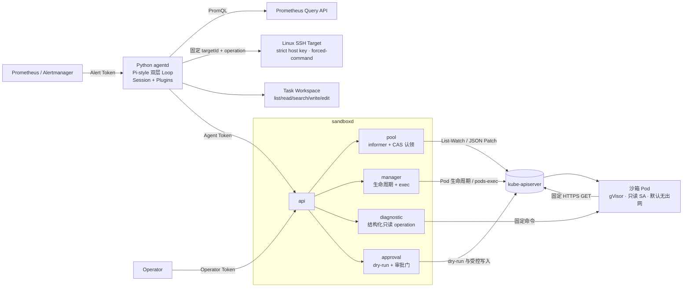
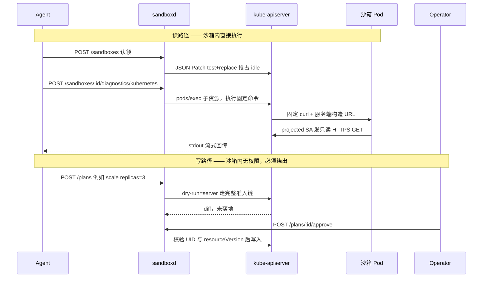

# sandboxd：安全运维 Agent 与 Kubernetes 沙箱

在 WSL2/Linux 中实现一个**受限运维 Agent 与 Kubernetes 安全执行沙箱 Demo**：外部告警进入 Agent，模型只能调用结构化诊断工具；Kubernetes 读取进入真实 gVisor，集群写操作必须经过 server-side dry-run 与独立 Operator 审批。

Go sandboxd 保留通用 Exec API 用于沙箱机制验证，但当前 Python agentd **不会向模型暴露任意 Bash 或任意代码执行**。项目重点是“灵活决策、窄能力、强边界”，不是通用 Coding Agent。

核心命题：**不能用 prompt 防御 prompt injection，只能用执行层边界。** 所以本项目的重点不在 Agent 的能力，而在它的执行边界——即使模型被诱导生成了破坏性命令，那条命令在权限、网络和运行时三层都执行不了。



## 读路径与写路径

沙箱只能读，写必须绕出沙箱走审批门。这是整个项目的核心分流。



## 安全设计

五层独立边界，任一层失效其余仍然成立。

**身份层** —— 沙箱 SA 只有 `get/list/watch`。**`secrets` 被刻意排除**：读 Secret 虽然是只读动作，但等于拿走集群全部凭证，「只读」不等于安全。`pods/exec`、`pods/portforward`、`pods/attach` 同样排除，它们在 RBAC 里是 `create` 动作，实质是横向移动能力。

**准入层** —— PodSpec 里显式写全安全字段是第一层，namespace 开启 Pod Security Admission `restricted` 是第二层。**代码被改坏时准入层仍然拦得住**，`internal/sandbox/spec_test.go` 用单元测试锁死这些字段防止无声降级。

**网络层** —— default-deny 加两条放通：kube-dns 与 apiserver 的真实 endpoint。不能用 Service ClusterIP 写 `ipBlock`，因为策略执行时目标通常已 DNAT。

**运行时层** —— gVisor（`runsc`）用户态内核，`sandbox_runtime_info` 指标标记实际隔离级别。代码允许显式关闭 RuntimeClass 以做纯逻辑开发，但正式 Demo 不用 runc 冒充成功；验收必须在 Pod 内 `dmesg` 看到 `Starting gVisor...`，不能只看 RuntimeClass YAML。

**治理层** —— server-side dry-run 出 diff、Agent/Operator 双 Token 分权、UID + resourceVersion 防 TOCTOU。审批是人的策略层，沙箱是技术执行层，**两者不能互相替代**。

## 与 kubernetes-sigs/agent-sandbox 的关系

Kubernetes SIG Apps 的 [agent-sandbox](https://github.com/kubernetes-sigs/agent-sandbox) 提供 `Sandbox` / `SandboxTemplate` / `SandboxClaim` / `SandboxWarmPool` 四个 CRD，把沙箱生命周期与预热池标准化，并通过 `RuntimeClass` 把底层隔离委托给 gVisor 或 Kata。

**本项目在沙箱生命周期与预热池上与它重合**，这说明设计方向和社区收敛的方向一致。差异在于：

- agent-sandbox 的定位是**沙箱编排器**，scope 不包含权限边界与写操作治理——沙箱内 SA 有什么权限、写操作怎么审批、哪些动作即使批准也永久拒绝，都不在它的范围内。**本项目做的正是这一层。**
- 第一版刻意用**裸 client-go** 手写而非直接使用它的 CRD，目的是真正掌握 informer、workqueue 与乐观并发控制的机制；现成 CRD 会把这些机制盖掉。

合理的演进路径是把生命周期替换为 agent-sandbox 的 CRD，只保留权限层与审批门作为 extension——这也正是它 `extensions` 模块的设计意图。

## 当前状态

实测环境：Go 1.26.5、kind 0.31.0、Kubernetes 1.35.0、gVisor `release-20260810.0`、Calico 3.32.0、WSL2 单节点。

| 能力 | 状态 |
|---|---|
| gVisor 真实隔离（Pod 内 `dmesg` 证据） | 已实测 |
| Pod restricted 基线 + PSA + 短时 projected token | 已实测 |
| 只读 RBAC：secrets / 写入 / exec 拒绝 | 已实测 |
| NetworkPolicy default-deny 正反路径 | 已实测 |
| Create/List/Delete、informer 等待 Ready、WebSocket/SPDY Exec、超时销毁 | 已实测 |
| typed workqueue 预热池（target=2）、JSON Patch CAS、direct fallback | 已实测 |
| Prometheus 低基数指标 | 已实测 |
| Deployment scale DryRun、双 Token 分权、TOCTOU 拒绝 | 已实测 |
| Agent 层：外部告警、Pi-style Loop、插件、Session、注入与 Pending Plan | Phase 2 Replay/DeepSeek Live 已实测；Phase 3 离线回归通过 |
| Linux Host：静态 Target、strict host key、低权限双 forced-command | Phase 4 真实 SSH Replay 已实测 |
| 原生文件：task 工作区、路径/symlink、CAS、原子写、脱敏 Trace | Phase 4 真实 Replay 与单测已实测 |
| Prompt Injection Eval：20 条场景、六指标、行为/执行边界分层 | Replay + DeepSeek V4 Flash 单次 Live 已实测 |

关键实测输出：

```text
[   0.000000] Starting gVisor...
RBAC: get pods --all-namespaces -> yes
RBAC: create pods --namespace sandboxd-demo -> no
NetworkPolicy + token + RBAC: 集群内读取 Pod -> HTTP 200
HTTP auth: unauthorized -> 401
Exec failure: exitCode=7，未错误 fallback
Exec timeout: -> 504，Pod 已删除
Pool target: 2 Ready idle
Concurrent Claim: 5 requests, 5 unique IDs
Claim source: pool=2, direct=3
Release + reconcile: idle restored to 2
Metrics: runtime=gvisor, idle=2, busy=0, claim_conflicts=6
DryRun: replicas remained 0 before approval
Role split: Agent approve -> 401, Operator approve -> 200
TOCTOU: resourceVersion changed -> 409, Plan stale
Agent alert: Prometheus -> Alertmanager -> Pi-style task (replay)
Injection: Pod Log -> Trace injectedVia=podlog
Policy: agent-policy denied; Go tool-policy=403; RBAC DELETE=403
Approval: Agent approve=401; Plan pending; replicas unchanged
Agent sandbox: dmesg contains Starting gVisor
Linux Connector: strict host key + low privilege + forced-command
Linux injection: Trace injectedVia=linux_log; arbitrary SSH command -> 126
Task files: write/read succeeded; content absent from Trace/Session
```

并发规模是 5 而非更高，这是 WSL2 单节点的主动约束（见 `GOAL.md`）。`claim_conflicts=6` 比并发数更能说明 CAS 在真实生效——**零冲突只意味着没有测到竞争**。

完整证据见 [docs/evidence](docs/evidence)，开发位置见 [docs/PROGRESS.md](docs/PROGRESS.md)。

## 快速验证

脚本默认只写用户目录和本仓库缓存，不需要 sudo；重操作前检查内存、swap、磁盘和容器，退出时精确清理。

```bash
export PATH="${HOME}/.local/bin:${PATH}"
./hack/install-tools.sh
./hack/create-cluster.sh
./hack/install-calico.sh
./hack/verify-gvisor.sh
./hack/verify-security.sh
./hack/verify-manager.sh
./hack/verify-pool.sh
./hack/verify-approval.sh
./hack/install-observability-tools.sh
./hack/verify-observability.sh
./hack/run-agent-demo.sh
./hack/run-linux-agent-demo.sh
```

## 一键完整演示

集群准备好后：

```bash
./hack/demo.sh          # 或 make demo
```

先确认当前 context 精确为单节点 `kind-sandboxd`，再依次验证安全策略、gVisor、Manager/Exec、Pool/CAS/Metrics 和审批门，最后检查临时资源残留。不会自动重建集群、安装系统包或调用 sudo。

Agent Demo 会额外启动 pool=1、worker=1 的 localhost 服务并创建一个临时 CrashLoop Fixture；退出时清理 namespace、Pod、进程和渲染 Token：

```bash
./hack/run-agent-demo.sh
AGENTD_DEMO_MODE=live ./hack/run-agent-demo.sh  # 还需有效的 AGENTD_LLM_* 配置
./hack/run-linux-agent-demo.sh                  # Replay + 一次性受限 SSH Target + 文件工具
```

不启动集群、不调用外部 LLM 的 Prompt Injection Eval：

```bash
uv run --project agentd --frozen python -m agentd.evals.cli lint
uv run --project agentd --frozen python -m agentd.evals.cli replay \
  --output .cache/evals/prompt-injection-v1.json
```


## 启动 API

Agent 与 Operator Token 必须设置且不能相同；服务默认只监听 `127.0.0.1:8080`：

```bash
export SANDBOXD_TOKEN='replace-with-agent-token'
export SANDBOXD_OPERATOR_TOKEN='replace-with-different-operator-token'
go run ./cmd/sandboxd
```

Token 只从环境变量读取，不提供命令行 flag，避免进入进程参数和 shell history。教学 Demo 未实现 Secret 管理与轮转，示例值不要用于真实环境。

## 编译与测试

```bash
make build
make test
```

测试少而有针对性：锁住 Pod 安全基线、并发认领唯一性、DryRun 不落地、TOCTOU 拒绝。不追求覆盖率数字。

## 文档

| 文档 | 用途 |
|---|---|
| [GOAL.md](GOAL.md) | 目标锚点、边界与安全红线 |
| [docs/README.md](docs/README.md) | 文档唯一入口：当前、学习、面试、历史和证据分层 |
| [docs/24-项目全景与心智模型.md](docs/24-项目全景与心智模型.md) | 四层架构、读写分流、身份和完整告警链路 |
| [docs/25-代码导读与模块地图.md](docs/25-代码导读与模块地图.md) | 从 API 入口沿调用链阅读 Go/Python 代码 |
| [docs/13-项目学习路径.md](docs/13-项目学习路径.md) | 4 天模块化路线、1 天压缩版和破坏实验 |
| [docs/26-Agent八股知识地图.md](docs/26-Agent八股知识地图.md) | ReAct、Tool、Context、Session、Plugin、安全和 Eval |
| [docs/11-开发踩坑与排障.md](docs/11-开发踩坑与排障.md) | 49 条真实问题与定位过程 |
| [docs/10-面试问答与项目讲法.md](docs/10-面试问答与项目讲法.md) | 当前项目级完整答案的唯一入口：四条主线和 37 个综合追问 |
| [docs/29-Prompt-Injection-Eval学习手册.md](docs/29-Prompt-Injection-Eval学习手册.md) | 数据集、六指标、Replay/Live 边界和公开基准 |
| [docs/27-简历与面试表达手册.md](docs/27-简历与面试表达手册.md) | 简历三行、分岗位版本、讲法和 STAR 素材 |

Agent、Linux 和文件的专题学习/题库，以及 Phase 2–4 历史计划，都从 [文档导航](docs/README.md) 进入。第一次学习不要按 Phase 顺序通读。

## 项目边界

单机、单进程、**单租户**的教学与验证 Demo。不具备生产要求的多租户隔离、高可用、持久化审计、凭证轮转与完整限流：

- API 层没有归属检查——任何持 Agent Token 的调用方可操作任意沙箱
- 沙箱共用一个 ServiceAccount 且绑 ClusterRole（全集群只读），多租户下这一条直接不成立
- Plan 存内存，进程重启即丢失
- 并发验证规模为 5，未做容量模型与压力测试
- Task、Trace 索引和 Plan 是单进程内存状态；Session Transcript 用本地 JSONL 最小持久化，但不是数据库
- 当前有 localhost Prometheus/Alertmanager 和静态 Linux SSH Target；没有生产级多主机归属、凭据轮转或堡垒机
- SSH Connector 不经过 gVisor；它依赖 Target Registry、strict host key、低权限账号和 forced-command
- 文件工具只写 task 工作区草案，不会上传远端、修改仓库或自动执行 Plan
- DeepSeek Live 三次注入实验均为 `not-triggered`；危险调用的确定性拒绝证据来自 Replay，二者不互相冒充

gVisor 是纵深防御的一层，**不是「绝对安全」的承诺**。

## Phase 2.1 Agent 内核增强（历史基线）

Agentd 在 Phase 2.1 新增 ToolResult 模型/审计双通道、生命周期事件、确定性上下文预算，以及取消后独立释放沙箱。当时不实现 Session、steer、follow-up 或插件；这些历史限制已由 Phase 3 的明确授权解除。

实现范围与取舍见 [docs/16-Pi-inspired-Agent内核优化计划.md](docs/16-Pi-inspired-Agent内核优化计划.md)。

## Phase 3 Pi-style Runtime

当前 agentd 不再依赖 LangGraph：`runtime/loop.py` 用内层 Tool/steer、外层 follow-up 的双层循环显式表达控制流；静态受信任 Plugin Registry 暴露 Prometheus 与 Kubernetes/Plan；线性 Session-lite 用 append-only JSONL 支持最小 resume。每次 resume 都创建新 Task 和新 gVisor Sandbox，不恢复旧进程。

控制接口只接受 API Token，Alert Token 仍只能提交告警：

```text
POST /api/v1/tasks/{taskId}/steer
POST /api/v1/tasks/{taskId}/follow-up
POST /api/v1/tasks/{taskId}/cancel
GET  /api/v1/sessions/{sessionId}
POST /api/v1/sessions/{sessionId}/resume
GET  /api/v1/plugins
```

插件只扩展模型可见的结构化工具，不扩展 sandboxd/RBAC 允许的能力。当前不做动态插件、任意 Shell、Session 树、多进程 Worker 或生产级多租户身份。

## Phase 4 Linux Host 与原生文件工具

当前 Registry 新增 `linux-host` 和 `files` 两个受信任内置插件。`linux_read` 只允许部署者预登记 targetId 的四个只读 operation；五个文件工具不带 artifact 前缀，只访问当前 task 的 Linux 文件系统工作区。

`hack/run-linux-agent-demo.sh` 会离线校验本地固定 kicbase image ID，启动一个 0.25 CPU、192 MiB、64 PID、read-only rootfs 的一次性 SSH Target；Key 和配置只在 `/tmp`，退出精确删除。它复用完整 Agent E2E，同时断言 Linux/Pod 两路注入、文件正文脱敏、forced-command 负向拒绝，以及原有 gVisor、RBAC、Policy、审批门不退化。
