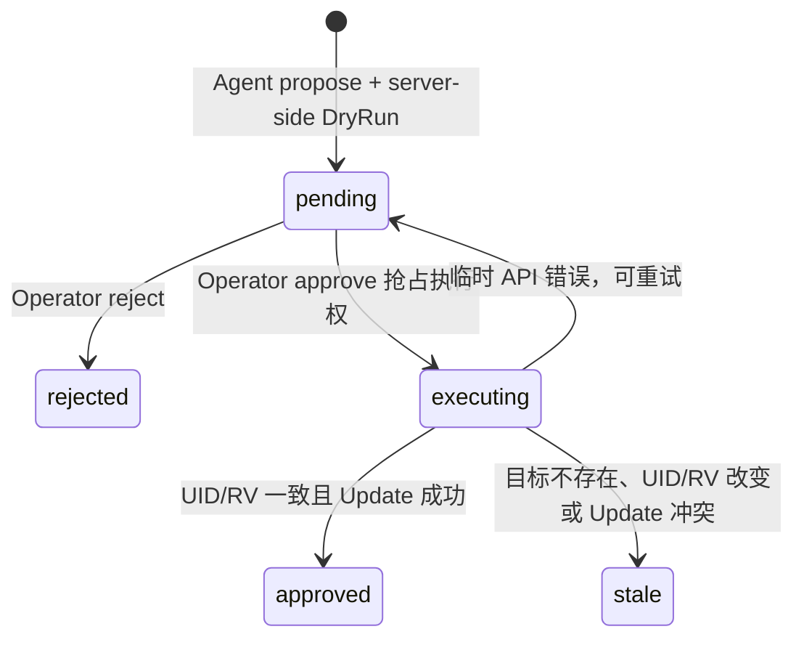

# Server-side DryRun 与 Operator 审批门

## 1. 这个模块解决什么问题

AI Agent 需要读取集群信息，但不能因为一段提示词就直接获得任意 Kubernetes 写权限。只用一句 system prompt 约束“不要执行危险操作”不是安全边界，因为 prompt injection、模型误判和业务代码缺陷都可能绕过自然语言约束。

本项目把唯一允许的写操作固定为 `Deployment scale`，并拆成两个角色：

- Agent Token：使用沙箱、提交 Plan、查看 Plan；
- Operator Token：查看 Plan、批准或拒绝；
- Agent Token 调用 approve/reject 会得到 401；
- 只有批准阶段才真正更新 Kubernetes 对象。

目标不是实现通用工作流平台，而是用最小代码展示“提案、校验、人类/高权限角色决策、执行前复核”的安全闭环。

## 2. 状态机与请求链路



`executing` 是内存中的短暂状态。它让两个并发 approve 请求中只有一个能继续访问 API Server，避免同一个 Plan 被重复执行。

## 3. 项目里的最小实现

### 3.1 固定输入，而不是任意 YAML

Agent 只能提交：

```json
{
  "namespace": "sandboxd-target",
  "name": "approval-demo",
  "replicas": 1
}
```

服务端代码固定调用 `AppsV1().Deployments(namespace).Update(...)`，不接受 verb、resource、JSON Patch 或命令字符串。这样权限边界能从代码中直接审查。

### 3.2 四层策略约束

1. namespace 不能为空，且拒绝 `default`、`kube-system`、`kube-public`、`kube-node-lease`、`sandboxd-demo`；
2. Deployment namespace/name 必须满足 Kubernetes DNS 命名规则；
3. replicas 只允许 `0–10`；
4. 必须先读取真实 Deployment，并让 Update 经过 server-side dry-run。

`sandboxd-demo` 也在拒绝列表中，是为了让 Agent 的执行沙箱和可操作目标分离。

### 3.3 DryRun 保存什么

DryRun 成功后，内存 Plan 保存：

- action 固定为 `deployment.scale`；
- namespace/name；
- before/after replicas；
- 目标 UID；
- 目标 resourceVersion；
- `dryRunValidated=true`；
- pending 状态和时间。

不会保存整个 Deployment，也不会保存任意用户 Patch，减少状态和攻击面。

### 3.4 Approve 如何防 TOCTOU

TOCTOU 是 Time Of Check To Time Of Use：校验时对象安全，不代表执行时对象仍是同一个版本。

Approve 会重新 GET Deployment，并同时比较：

- UID：防止同名 Deployment 被删除重建；
- resourceVersion：防止原对象在审批窗口发生任何修改。

两者一致后，Update 仍携带当前 resourceVersion；如果 GET 与 Update 之间再次变化，API Server 的乐观锁会返回 Conflict。项目把这种 Plan 标记为 stale，要求重新提交和审核。

## 4. 代码阅读顺序

1. `internal/approval/types.go`：Plan、状态和错误；
2. `internal/approval/service.go`：策略、DryRun、状态机和 TOCTOU 校验；
3. `internal/api/server.go`：Agent/Operator 路由分权；
4. `internal/api/plan_handler.go`：JSON 边界和错误码映射；
5. `internal/config/config.go`：双 Token 必填且不能相同；
6. `deploy/smoke/approval-target.yaml`：最小受控目标；
7. `hack/verify-approval.sh`：真实正反路径。

## 5. 必须掌握的八股知识

### Server-side DryRun 做了什么

请求真正发送到 API Server，通常会经过：

- authentication；
- authorization；
- 默认值处理；
- validating/mutating admission（Webhook 必须声明支持 dry-run）；
- schema 和对象校验。

但请求不会持久化到 etcd，也不会产生真实 Deployment 变更。

### DryRun 不是什么

- 不是事务；
- 不是资源预留；
- 不保证几秒后真实执行仍会成功；
- 不阻止别人修改对象；
- 不代替执行前重新校验。

因此本项目必须同时使用 DryRun、UID/resourceVersion 和 Update 乐观锁。

### Authentication 与 Authorization 的区别

- Authentication 回答“你是谁”；
- Authorization 回答“你能做什么”。

Demo 用两个 Bearer Token 做应用层角色识别，并用不同路由表达权限。运行 sandboxd 的 kubeconfig 仍是执行 Kubernetes Update 的基础权限。生产环境应给服务自己的 ServiceAccount 和最小 RBAC，而不是使用管理员 kubeconfig。

### 401 与 403 的区别

- 401：当前凭证不能通过该端点的身份要求；
- 403：身份已识别，但策略明确禁止动作。

本 Demo 的路由中间件只接受该角色 Token，因此 Agent 调 Operator 路由返回 401。更完整的身份系统可以先统一认证，再按角色返回 403。

### resourceVersion 与 generation 的区别

- resourceVersion 标识对象在存储中的版本，metadata、spec、status 变化都可能改变；
- generation 主要跟踪期望状态 spec 的代际，status 更新通常不增加 generation。

本项目用 resourceVersion 做保守校验：任何变化都要求重新审核。若生产系统只关心 spec，可保存并比较经过归一化的 spec/generation，但实现更复杂。

## 6. 为什么采用当前方案

### 为什么不做通用 Patch API

通用 Patch 很难可靠限制路径，可能改镜像、ServiceAccount、securityContext、hostPath 等敏感字段。固定 scale 动作只有一个整数参数，校验和讲解都更清晰。

### 为什么 Plan 只存内存

本项目是单机、单进程面试 Demo。内存 map 加互斥锁已经能展示状态机和并发保护。数据库、CRD、审批通知、审计留存属于生产扩展，不影响核心知识点。

### 为什么双 Token 必须不同

如果 Agent 和 Operator 使用同一个 Token，路由分权只是表面形式。启动时直接拒绝相同 Token，可以把职责分离变成可验证的不变量。

## 7. 真实验证结果

2026-08-18 在当前单节点 kind 集群执行 `./hack/verify-approval.sh`：

```text
DryRun: replicas remained 0 before approval
Role split: Agent approve -> 401, Operator list/approve -> 200
Approve: Deployment replicas 0 -> 1, gVisor Pod became Available
TOCTOU: resourceVersion changed -> 409, Plan stale, replicas stayed 1
Reject: Plan rejected, repeated approve -> 409, replicas stayed 1
Policy metrics: namespace=1, replicas=1, changed=1, state=1
```

验证只创建一个独占 namespace，最多运行一个 memory limit 为 32Mi 的 gVisor pause Pod。退出后 namespace、Pod、sandboxd 进程全部清理，swap 为 0。

## 8. 本模块值得面试讲的坑

### fake client 不会自动模拟 DryRun

client-go fake 默认把 Update 直接写入 tracker，即使 `UpdateOptions.DryRun` 非空。如果测试不拦截，Propose 阶段会“假装”修改真实对象，得到与 API Server 完全不同的语义。

测试用 reactor 检查 DryRun option，返回候选对象但不更新 tracker；真实 Approve Update 才交给默认 reactor 落地。

### DryRun 成功后真实执行仍可能失败

DryRun 与 Approve 之间，配额、准入配置、目标对象或其他依赖都可能变化。因此 Plan 不能把 `dryRunValidated=true` 当成永久通行证。

### 只比较名字无法防删除重建

同 namespace/name 的 Deployment 被删除后重建，已经是另一个对象。UID 能识别对象身份，resourceVersion 能识别同一对象的版本，两者解决的问题不同。

### 状态检查和执行也存在并发窗口

如果两个请求都先读到 pending，再各自 Update，Plan 可能执行两次。项目先在 mutex 下把 pending 改成 executing；第二个请求只能得到 409。

## 9. 面试高频问答

### Q：为什么有 RBAC 还需要审批门？

RBAC 控制服务身份能否调用 Kubernetes API；审批门控制某次业务意图是否允许执行。服务为了 scale 必须拥有有限 Update 权限，但不代表每个 Agent 请求都应自动使用这项权限。

### Q：为什么不让 Agent 自己调用 dry-run 后再执行？

因为同一个低信任主体既提案又批准，无法形成职责分离。Agent 只产生意图，Operator Token 才能进入执行路径。

### Q：resourceVersion 变化就拒绝会不会太严格？

会产生保守的 false reject，例如 status 更新也可能改变它。但安全审批中“重新提交一次”比在未知新版本上执行旧意图更可接受；这是 Demo 有意选择的安全优先取舍。

### Q：服务崩溃时 executing Plan 怎么办？

内存 Plan 会全部丢失，这是明确非生产边界。生产实现要持久化状态、使用幂等 operation ID、恢复 executing 状态并保留不可抵赖审计。

### Q：如何改造成生产权限模型？

为 sandboxd 使用专用 ServiceAccount，只授予指定 namespace 中 Deployment `get/update`；Operator 身份接入 OIDC/RBAC；Token 使用 Secret 和轮转；Plan/审计持久化；API 加 TLS、限流和结构化审计日志。

## 10. 自己动手验证

```bash
./hack/verify-approval.sh
```

也可以先单独运行核心逻辑测试：

```bash
go test ./internal/approval -count=20
```

## 11. 一分钟项目讲法

“我没有让 AI Agent 拿通用 Kubernetes 写接口，而是把唯一动作固化成 Deployment scale。Agent Token 只能提交 Plan，服务先限制 namespace 和 0–10 副本，再做 server-side dry-run；Operator Token 才能批准。Plan 保存 UID 和 resourceVersion，批准前重新 GET 对比，Update 本身再用 Kubernetes 乐观锁防第二个窗口。状态先从 pending 原子切到 executing，避免重复批准。实测 Agent approve 返回 401，Operator 把副本从 0 扩到 1；审批期间修改对象后旧 Plan 返回 409/stale，不会执行。这展示了 prompt injection 场景下自然语言约束之外的代码级安全边界。”
