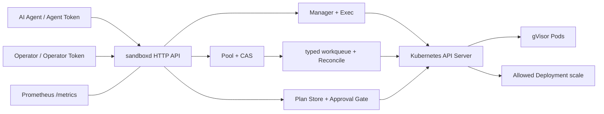

# sandboxd 秋招面试问答与项目讲法

> 这份文档用于项目复习和模拟面试。先掌握“30 秒介绍、三条主线、三个真实坑、项目边界”，再按模块补知识点。不要背未经理解的术语，也不要把 Demo 包装成生产平台。

## 1. 30 秒项目介绍

“我在 WSL2 上做了一个 Kubernetes AI Agent 沙箱 Demo。执行侧用真实 gVisor RuntimeClass，Pod 使用 restricted 安全上下文、只读 RBAC 和 Calico NetworkPolicy；控制侧用 client-go informer/workqueue 管理大小为 2 的预热池，通过 JSON Patch test/replace 做并发 CAS 认领；API 支持有上限输出的 Exec 和超时销毁。对于写集群操作，我没有给 Agent 通用权限，而是只允许提交 Deployment scale Plan，先 server-side dry-run，再由独立 Operator Token 批准，并用 UID/resourceVersion 防 TOCTOU。项目有 Prometheus 指标和一键低资源验收，每个结论都有真实 kind 证据。”

## 2. 三分钟项目展开

### 第一条主线：纵深防御

gVisor 把应用系统调用交给用户态 Sentry 处理，减少直接暴露给宿主内核的攻击面。但它不是绝对安全，所以 Pod 仍然：

- 非 root；
- drop ALL capabilities；
- 禁止提权；
- RuntimeDefault seccomp；
- 只读根文件系统；
- CPU/内存/emptyDir/运行时间有上限；
- 默认不挂 SA token，只投影短时 token；
- RBAC 不允许 secrets、write、pods/exec；
- NetworkPolicy 默认拒绝，只放 DNS 和 API Server endpoint。

真实验证不是只看 RuntimeClass YAML，而是在 Pod 内看到 `Starting gVisor...`，并做网络/RBAC 正反测试。

### 第二条主线：控制器与并发

Manager 使用 informer lister 等待 `PodReady=True`，避免每个请求轮询 API Server。Pool 的事件 handler 只入一个固定 key，由 typed rate-limiting workqueue 的单 worker 做幂等 Reconcile。

池目标为 2；Claim 从 Ready idle 候选中用 JSON Patch：

```text
test    /metadata/labels/sandbox.io~1state == idle
replace /metadata/labels/sandbox.io~1state = busy
```

`test + replace` 在 API Server 内原子执行。竞争失败换下一个候选；池空则 direct cold start。Release 直接删除，不复用可能被命令污染的 Pod，再由 Reconcile 补新。

真实 5 并发得到 5 个唯一 ID，pool=2/direct=3，并观察到 6 次 CAS 冲突。

### 第三条主线：AI 写操作审批

Agent 自然语言提示不是安全边界。项目把唯一写操作固定为 Deployment scale：

- Agent Token：propose/list；
- Operator Token：list/approve/reject；
- namespace denylist；
- replicas 0–10；
- Propose 做 server-side dry-run；
- Plan 保存 UID/resourceVersion；
- Approve 重新 GET 校验；
- pending→executing 原子状态切换防重复批准；
- Update 继续使用 resourceVersion 乐观锁。

实测 Agent approve=401；Operator 批准后副本 0→1；审批期间改动对象后返回 409/stale，旧 Plan 不执行。

## 3. 架构速记图



## 4. 模块快速复习表

| 模块 | 一句话核心 | 代码入口 | 最关键证据 |
|---|---|---|---|
| gVisor | RuntimeClass 选择 runsc，Sentry 拦截系统调用 | `hack/create-cluster.sh` | Pod `dmesg` 出现 Starting gVisor |
| Pod 安全 | 限权、限资源、限文件系统 | `internal/sandbox/spec.go` | PSA restricted 接受安全 Pod、拒绝不安全 Pod |
| RBAC | 只读不等于可读 Secret | `deploy/rbac.yaml` | get pods=yes，get secrets/write/exec=no |
| 网络 | API 对象由 CNI 数据面执行 | `deploy/networkpolicy.yaml.tmpl` | API=200，example.com 超时 |
| Exec | WebSocket 优先，仅传输错误 fallback | `internal/sandbox/exec.go` | exit 7 不重放，超时 504 并删 Pod |
| Informer | 本地缓存读，事件驱动协调 | `cmd/sandboxd/main.go` | Running 未 Ready 不误判 |
| Pool/CAS | test+replace 原子抢占 | `internal/sandbox/pool.go` | 5 并发 ID 唯一，冲突可观测 |
| Metrics | 低基数指标解释机制 | `internal/metrics/metrics.go` | pool/direct、idle/busy、timeout、denied |
| Approval | 固定动作 + 双角色 + TOCTOU 复核 | `internal/approval/service.go` | DryRun 不落地，Agent 401，stale 409 |

## 5. 最值得讲的四个真实坑

### 坑一：RuntimeClass 存在不代表真的用了 gVisor

排查分三层：声明的 RuntimeClass、节点 containerd handler、Pod 内真实内核视图。最终用 `dmesg` 而不是 YAML 截图作为运行证据。

### 坑二：Exec 对所有错误 fallback 会重复执行命令

命令 exit 7 是业务结果，不是 WebSocket 升级失败。如果盲目换 SPDY 重试，带副作用命令会执行两遍。最终只对 upgrade/proxy 错误 fallback，并保留 exit code。

### 坑三：informer 创建时机导致缓存永远不同步

SharedInformerFactory 是 lazy init；如果在 `Start()` 后才第一次取某类 informer，它不会被这一轮启动。项目先实例化 Pod informer，再 Start 和 WaitForCacheSync。

### 坑四：fake client 的 DryRun 会“假落地”

client-go fake 不模拟 API Server 的 dry-run 语义。测试增加 reactor：DryRun Update 只返回副本，不写 tracker；真实 Approve 才落地。

更多素材见 [开发踩坑与排障](11-开发踩坑与排障.md)。

## 6. Kubernetes 与容器高频问答

### Q1：容器、gVisor、虚拟机隔离有什么区别？

普通容器共享宿主内核；gVisor 用用户态内核实现大部分 Linux 系统调用，降低宿主内核暴露面，但兼容性和性能有成本；虚拟机提供独立 guest kernel，边界更强但启动和资源开销通常更大。

### Q2：gVisor 为什么仍需要 seccomp 和非 root？

安全机制解决不同层面的问题。gVisor 降低宿主 syscall 攻击面；非 root/capability 降低容器内权限；seccomp 再限制系统调用；只读根文件系统和资源 limit 限制持久化与耗尽。纵深防御不能只押一层。

### Q3：RuntimeClass 的工作流程是什么？

PodSpec 的 `runtimeClassName` 引用 RuntimeClass handler；kubelet 通过 CRI 把 handler 交给 containerd；containerd 根据 runtime 配置启动对应 shim/runsc。

### Q4：Pod Running 和 Ready 有什么区别？

Running 表示至少一个容器已运行或启动中；Ready condition 表示探针和就绪条件通过、适合接收工作。Manager 等 Ready，不只看 Phase。

### Q5：requests 和 limits 分别做什么？

requests 影响调度和资源保证；limits 限制可使用上限。CPU limit 通常通过 CFS throttling，内存超过 limit 可能 OOM kill。

### Q6：为什么不自动挂载 ServiceAccount token？

多数不访问 API 的 workload 不需要凭证。默认 token 增加泄露面；需要时用 projected token 指定 audience/expiration，并配最小 RBAC。

### Q7：为什么“只读 ClusterRole”也不该读 Secret？

Secret 常包含 Token、密码和证书，读取本身就能转化为其他身份和写能力。语法上的 get 是读，安全效果可能是权限提升。

### Q8：为什么有 NetworkPolicy 还可能不生效？

NetworkPolicy 是声明，执行依赖支持它的 CNI。kindnet 不执行策略，所以项目安装 Calico，并用正反流量验证数据面。

### Q9：default-deny 后为什么要单独放 DNS？

域名访问先依赖 CoreDNS 的 UDP/TCP 53。只允许目标业务 IP 而忘记 DNS，会让所有域名表现为网络故障。

### Q10：为什么 API Server 要取 EndpointSlice 地址？

Service ClusterIP 会 DNAT，策略执行点可能看到后端 endpoint；原生 NetworkPolicy 也不能写 DNS 名。EndpointSlice 是当前推荐的后端发现 API。

## 7. Go/client-go 与并发高频问答

### Q11：Informer、Lister、Workqueue 如何配合？

Informer list/watch 并维护本地 cache；Lister 从 cache 读；event handler 只把 key 放进队列；worker 根据 key 重读当前状态并 Reconcile。事件是触发器，不是最终事实。

### Q12：为什么 handler 不直接创建/删除 Pod？

handler 应短小，避免阻塞事件处理，也避免基于过期事件对象做复杂决策。副作用集中到可重试、幂等的 Reconcile。

### Q13：为什么队列只放固定 key？

这个 Demo 只有一个全局池目标，不需要逐对象控制器。固定 key 能合并重复事件，单 worker 串行维护容量，不引入多 key 并发复杂度。

### Q14：Reconcile 为什么必须幂等？

事件可能重复、丢失或乱序，队列也会重试。同一状态重复执行应得到相同结果；控制器根据当前 cache 状态逼近期望状态，而不是假设一次事件只处理一次。

### Q15：JSON Patch test 为什么能做 CAS？

API Server 原子执行一个 Patch。只有 label 仍为 idle 时 test 成功并 replace 为 busy；另一个请求看到 test 失败，无法同时认领同一 Pod。

### Q16：resourceVersion 与 JSON Patch test 有何区别？

resourceVersion 通常保护整个对象版本；JSON Patch test 可以只校验关心的字段。Pool 只需要 state 从 idle→busy，所以字段 CAS 更直接；审批需要确保审核对象完全没变，使用 UID/resourceVersion 更保守。

### Q17：为什么 Pool Release 不复用 Pod？

Exec 可能留下文件、进程、环境和其他污染。清理所有状态既复杂又容易遗漏；删除后补新代码更简单，隔离语义更明确。

### Q18：context 超时后为什么用新 context 清理？

已 Done 的 context 传给 Delete 会立即失败。项目为补偿动作创建独立 10 秒 cleanup context，既能清理又不会无限阻塞。

### Q19：为什么全局互斥锁不能跨 API 调用一直持有？

外部调用延迟不可控，持锁会阻塞 list/reject/其他 approve。项目只在锁内把 pending 抢占为 executing，随后释放锁调用 API；完成后再短暂持锁更新状态。

## 8. 可观测与审批高频问答

### Q20：Counter、Gauge、Histogram 怎么选？

单调事件数用 Counter；当前池大小用 Gauge；获取/执行耗时分布用 Histogram。不要把 ID、Pod 名或命令放进 label。

### Q21：为什么 Pool Gauge 可能短暂不准？

它由 Reconcile 基于 informer cache 更新，API 请求和事件传播有时间差，是最终一致快照。验收等待状态收敛后再断言。

### Q22：server-side DryRun 能保证批准时成功吗？

不能。它只证明提交时的请求可通过真实 API Server 校验，不锁对象、不预留资源。批准前仍需重新读取和并发控制。

### Q23：为什么同时比较 UID 和 resourceVersion？

UID 防同名对象删除重建，resourceVersion 防同一对象在审批期间修改。Update 自身继续携带 resourceVersion，覆盖第二个竞争窗口。

### Q24：双 Token 与 Kubernetes RBAC 是什么关系？

双 Token 是 sandboxd 应用层职责分离；Kubernetes RBAC 限制 sandboxd 这个服务身份能调用哪些 API。生产中两层都需要，且服务应使用专用 ServiceAccount，不用 admin kubeconfig。

### Q25：为什么 Agent approve 返回 401 而不是 403？

本 Demo 每条角色路由只认证对应 Token，Agent Token 对 Operator 路由不是可接受身份，所以返回 401。统一身份系统可以认证后再按角色授权并返回 403。

## 9. Agent 架构选型问答

> 本节回答的不是「这些概念是什么」，而是「为什么这个项目没有引入它们」。
> 统一模板：**它解决什么问题 → 我的场景里该问题是否存在 → 什么条件下它才合理。**
> 面试官问「你了解 X 吗」时，答判断而不是答定义。

### Q26：为什么只用 ReAct，不上 Plan-and-Execute？

Plan-and-Execute 先产出完整计划再逐步执行，优势是长任务不容易跑偏、可以提前审查计划。我的任务是单轮集群排查，工具只有两个、轮数上限 6，计划空间小到不需要单独的规划阶段；引入它只会增加一层无法被 Trace 清晰解释的中间状态。

另外一个实际原因：项目里已经有 `approval.Plan` 这个概念（写操作意图 + DryRun diff + UID/resourceVersion）。再引入 agent 侧的 plan，两个 Plan 会撞车，增加理解成本。

如果任务变成跨多个 namespace、需要几十步的变更编排，Plan-and-Execute 才值得引入。

### Q27：你的审批门和 Plan-and-Execute 是什么关系？

**是同构的，而且我的版本把 plan 阶段交给了人。**

Plan-and-Execute 的核心是「先产出可审查的计划，再执行」，但计划是给模型自己看的。我的审批门也是先产出计划（server-side DryRun 出 diff）再执行，区别在于**计划是给人审计的检查点**，并且执行权由独立的 Operator Token 持有。

换句话说：Plan-and-Execute 用规划提升模型的可靠性，审批门用规划提升系统的可控性。前者是能力问题，后者是权限问题。

### Q28：有没有做 Replan？

有，但是隐式的。工具调用被拒绝时，我不终止循环，而是把 `denyLayer`（whitelist / argcheck / rbac / approval）作为 observation 回灌给模型，模型会尝试替代路径——这就是最小形态的 replan。

我刻意没有把它做成独立模块，因为**这段行为本身是注入实验的观察对象**：模型在被拒绝后是放弃、换合法手段、还是反复撞同一面墙，全部记录在 Trace 里。做成框架反而会把这个观察点藏起来。

### Q29：为什么不用 RAG？

RAG 解决的是「知识分散在大量静态文档里、塞不进 context」。我的知识源是**实时集群状态**，通过 tool call 按需获取——**tool calling 就是我的检索层**，而且是精确检索（apiserver 是权威数据源）而不是语义近似检索。给一个有权威实时 API 的数据源套向量检索是架构倒退。

更重要的是它会削弱项目的核心命题：**向量库里的 chunk 同样是不可信内容**，引入 RAG 等于新增一个注入面，还要再防一遍，而「执行层边界」这个命题一点没被增强。

唯一合理的场景是检索历史 incident 与 runbook 文档（HolmesGPT 有这类 toolset），但那属于上游的诊断能力，是我明确划到 scope 之外的部分。

### Q30：chunk 策略和 reranker 怎么选？

在这个项目里这个问题不存在——没有 RAG 就没有 chunk 和 rerank。

如果扩展到 runbook 检索，我会按文档的自然结构切（按标题层级而不是固定 token 数），因为 runbook 的语义边界是章节而不是长度；reranker 的价值在于召回宽、精排准，但它引入额外一次模型调用的延迟和成本，**在工具调用只需要精确匹配的场景里性价比很低**。

这条我只能给设计判断，没有实测数据，因为项目里没做。不会假装做过。

### Q31：为什么不做多 Agent 协作？

多 Agent 的收益在于任务可以按角色分解、并行推进。我的任务是单次排查，分解没有收益；而且每多一个 Agent 就多一份 context，**注入的传播面也随之变大**——一个 Agent 读到注入内容后把它写进给另一个 Agent 的消息里，就绕过了原始的不可信数据标记。

从安全角度说，多 Agent 让「不可信数据从哪进来的」变得难追溯，这与项目目标相反。

### Q32：MCP 是什么，为什么没实现？

MCP 是工具接入的标准协议，解决的是「每个 Agent 框架各写一套工具适配」的重复问题。我的工具只有两个且都是自己的服务内部接口，标准化没有收益。

值得说的是**它和我的设计在同一个问题上做了不同选择**：MCP 让工具易于接入，我的白名单让工具难以滥用。如果要接 MCP，我会把 MCP server 放在 sandboxd 之后而不是之前——**协议层负责连通性，边界层负责授权，两者不能合并**。

### Q33：为什么 Demo 默认走 replay 而不是实时调模型？

三个理由：面试现场网络或 API key 不可靠；LLM 有随机性，同一段注入不保证每次都触发，replay 保证演示过程可复现；以及 CI 能覆盖 Agent 循环逻辑而不依赖外部服务。

原始的 live trace 保留在 `docs/evidence/` 里可查，replay 用的是其中一次真实交互的录制，不是编造的响应。**把不确定的外部依赖变成可回放的固定输入，是让演示和测试可信的标准做法。**

## 10. 项目边界与反问追答

面试官问“能不能上生产”时，应明确回答不能直接上，缺少：

- 多租户隔离和 namespace/identity 映射；
- TLS、OIDC、Token 轮转、限流；
- 专用最小 RBAC 的 in-cluster 部署；
- Plan/审计持久化和不可抵赖日志；
- 多副本、leader election、崩溃恢复；
- 镜像供应链、签名和准入策略；
- SLO、告警、容量模型和压力测试；
- 更全面的逃逸/网络/故障注入测试。

这个回答不会削弱项目，反而证明你理解 Demo 与生产的边界。

## 11. 可用于简历的表述

### 一行版本

基于 Go、Kubernetes client-go、gVisor 与 Calico 实现 AI Agent 执行沙箱 Demo，覆盖 Pod 纵深防御、预热池 CAS 并发认领、受控 Exec 及 DryRun/双角色审批。

### 三条 bullet 版本

- 在 WSL2 单节点 kind 中集成真实 gVisor `runsc`，设计 restricted Pod 安全基线、短时 SA Token、最小只读 RBAC 与 default-deny NetworkPolicy，并用 Pod 内 `dmesg` 和正反流量证明隔离链路。
- 基于 client-go informer/lister、typed workqueue 实现目标容量为 2 的预热池，通过 JSON Patch `test+replace` CAS 防重复认领；真实 5 并发获得 5 个唯一沙箱，池命中 2、冷启动 3。
- 实现 WebSocket/SPDY Exec、超时销毁、Prometheus 低基数指标，以及仅允许 Deployment scale 的 server-side DryRun Plan；使用 Agent/Operator 双 Token 和 UID/resourceVersion 校验阻止越权与 TOCTOU。

不要写“生产级”“绝对安全”“高并发平台”“性能提升 X%”，因为项目没有这些证据。

## 12. 演示顺序

环境已准备好时：

```bash
./hack/demo.sh
```

它按以下顺序运行：

1. 校验当前 context 必须是单节点 `kind-sandboxd`；
2. 资源检查；
3. PSA/RBAC/NetworkPolicy；
4. 真实 gVisor；
5. Manager/Exec；
6. Pool/CAS/Metrics；
7. DryRun/Approval/TOCTOU；
8. 最终残留检查。

如果本机安装了 make，也可使用 `make demo`。脚本不会自动重建集群、安装系统包或调用 sudo。

## 13. 面试前 15 分钟复习路线

1. 背熟第 1 节 30 秒介绍，但用自己的语言讲；
2. 复述第 2 节三条主线；
3. 选择第 5 节两个坑讲完整定位过程；
4. 快速扫第 4 节表格，确保能找到代码入口；
5. 复习 Q1、Q11、Q15、Q18、Q22、Q23；
6. 若面试偏 AI 方向，加读第 9 节 Q26、Q29、Q33；
7. 最后明确第 10 节生产边界。
