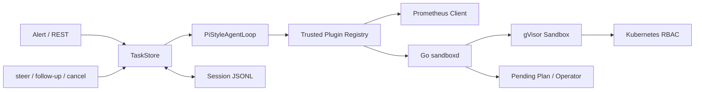

# Pi-style 安全可插拔 Agent Runtime 学习手册

> 这是 Phase 3 当前实现的主学习文档。项目借鉴 Pi 的 Transcript、双层循环、steer、follow-up、Session 和 Extension 分层思想，但没有引入 Pi、Node.js 或完整 Coding Agent 能力。

## 1. 先记住一句话

模型负责提出候选动作，Runtime 负责循环和协议，插件负责把工具意图接到窄客户端，Go sandboxd/RBAC/gVisor/审批门才负责真正授权与隔离。



这个分层是项目最重要的面试点：Agent 更灵活了，但没有因此获得宿主 Shell、任意网络、kubeconfig 或 Operator Token。

## 2. 五个身份不要混

| 身份 | 含义 | 生命周期 |
|---|---|---|
| alert fingerprint | 同一告警的短时去重键 | 10 分钟内存窗口 |
| taskId | 一次 Agent 运行 | queued 到终态 |
| sessionId | 一条线性事故会话 | 可跨多次 resume |
| sandboxId | 一次运行认领的 gVisor 沙箱 | claim 到 release |
| planId | 一次待审批写意图 | pending 到 approve/reject/stale |

`resume` 会沿用 sessionId，但生成新 taskId 并认领新 sandboxId。旧进程和旧 Sandbox 不恢复，这让资源语义简单、可审计。

## 3. 最省时间的代码阅读顺序

1. `agentd/app/runtime/control.py`：两个 FIFO 是什么。
2. `agentd/app/runtime/loop.py`：两个 `while` 怎样组成 Agent Loop。
3. `agentd/app/plugins/base.py` 与 `registry.py`：工具怎样注册和分派。
4. `agentd/app/runner.py`：Sandbox 为什么包在 Agent 外层。
5. `agentd/app/runtime/session.py`：消息怎样脱敏并落 JSONL。
6. `agentd/app/store.py`：task/session/sandbox 控制身份怎样关联。
7. `agentd/app/main.py`：HTTP API 只是最外层适配。
8. `agentd/app/policy.py` 与 Go `internal/diagnostic`：最后确认真正安全边界。

`agentd/app/graph.py` 现在只是兼容旧导入的薄文件，不再是核心实现。

## 4. 双层循环怎么读

### 4.1 Turn 的定义

本项目把“一次模型调用，以及该响应产生的一组顺序工具执行”叫一个 Turn。

```text
模型调用
  ├─ 无 Tool Call -> 当前 Turn 结束
  └─ 有 Tool Call -> 校验 -> 顺序执行 -> ToolMessage -> 当前 Turn 结束
```

工具不并行，原因不是做不到，而是 Demo 更重视：

- 调用次数和 Prometheus 次数容易准确计数；
- 拒绝、证据和 Plan 的先后顺序确定；
- steer 的安全点清楚；
- 面试时可以直接从 Trace 还原行为。

### 4.2 内层循环

内层处理普通 Tool Calling 和 steer：

```python
while has_more_tool_calls or pending_steer:
    注入 pending steer
    调模型
    校验并顺序执行工具
    在完整 Turn 后读取新 steer
```

steer 不是中断。它在当前 Turn 完成后的安全点进入下一轮，不能撤回已经发送给外部系统的请求。

### 4.3 外层循环

当模型没有 Tool Call、也没有 steer，本来准备结束时，外层才读取 follow-up：

```python
while True:
    运行内层循环
    if 有 follow-up:
        回到内层
    else:
        结束
```

这个结构比把所有消息塞进一个队列更有语义：steer 是“改变当前任务方向”，follow-up 是“当前回答结束后再补一项”。

## 5. steer、follow-up、cancel 的区别

| 命令 | 进入时机 | 是否撤回已执行动作 | 典型用途 |
|---|---|---|---|
| steer | 当前 Turn 后 | 否 | “先不要提 Plan，只查证据” |
| follow-up | Agent 自然结束后 | 否 | “再给一个值班交接摘要” |
| cancel | 立即取消运行 Task | 不能保证撤回外部副作用 | 用户停止、超时、错误任务 |

cancel 直接取消 Runner 的 asyncio Task，不伪装成一条对话消息。Runner 的 `finally` 再用独立清理 Task 释放已认领 Sandbox。这里要会讲协程取消：取消在下一个 `await` 注入 `CancelledError`，所以资源清理需要独立生命周期和超时窗口。

当前两个消息队列只适用于单进程、单事件循环。若改成多进程 Worker，内存 FIFO 会失效，必须换数据库/消息队列并加任务所有权；本 Demo 明确不做。

## 6. 插件为什么叫“受信任内置插件”

插件接口只有四个核心概念：

- `PluginManifest`：id、版本、说明、capability；
- Tool Schema：告诉模型工具名称和参数；
- Tool Handler：把合法参数交给窄客户端；
- `PluginContext`：只给当前 sandboxId 和已构造客户端。

注册表在代码中显式注册 `prometheus` 和 `kubernetes`。它不扫描目录、不从网络下载、不执行用户提供的 Python，也没有任意 Shell。

### 插件声明不等于授权

Tool Schema 只影响模型“看到什么”；Registry 只决定“分派给谁”。它们都可以被绕过，因此授权必须继续独立存在：

```text
模型 Tool Call
  -> Python validate_tool_call（早拒绝）
  -> Plugin Registry（窄分派）
  -> Go tool-policy（服务端可信校验）
  -> gVisor + NetworkPolicy + Kubernetes RBAC
  -> Pending Plan + Operator Token（写路径）
```

如果以后增加 Linux Host Connector，正确做法是注册固定只读 operation，例如读取指定测试目标的进程摘要，而不是把 SSH 私钥和任意命令交给模型。

## 7. Session-lite 怎样工作

### 7.1 为什么用 JSONL

每行一个完整事件：

- `session.header`：初始 sessionId、taskId、告警；
- `run.started`：resume 创建的新运行；
- `session.command`：steer、follow-up、cancel；
- `session.transcript`：一次运行的完整公开消息快照；
- `session.result`：运行终态和有界摘要。

JSONL 的好处是实现小、追加写、进程中断最多损失最后一行，面试时也容易查看。代价是没有事务、索引、并发写入协议和 Session 树，所以它只适合单进程 Demo。

### 7.2 保存什么，不保存什么

保存 Provider 无关的 role、content、toolCalls 和 toolCallId。不保存：

- HTTP Authorization Header；
- API Key、Token 和原始凭据；
- `additional_kwargs`；
- Provider 私有字段与隐藏思维；
- 旧 Sandbox 进程状态。

Tool 参数不能先整体转 JSON、正则替换再 `json.loads`。替换可能破坏引号，长度截断也可能产生半段 JSON。本项目对字符串叶子递归脱敏，再序列化合法结构。

### 7.3 文件权限与 WSL 坑

Session 目录和文件分别尝试设为 0700、0600。它们必须放 WSL 原生 Linux 文件系统；`/mnt/c` 的 DrvFS 若未启用 metadata，chmod 可能仍显示 0777。仓库可以在 `/mnt/c`，但运行时 Session/Token/Trace 不应把 POSIX 权限当成那里可靠的安全边界。

### 7.4 resume 的真实含义

resume 读取最后一个完整 Transcript，追加一个普通 HumanMessage，然后创建新 Task。它不恢复旧模型 TCP 连接、不恢复半个 Tool Call、不复用旧 Sandbox。

这叫“语义恢复”，不是“进程快照恢复”。优点是简单安全；缺点是旧 Observation 可能过时，所以恢复后 Agent 应重新查询实时系统。

## 8. Trace、Session 和最终结果的区别

- Trace：一次 Task 的执行证据，记录插件、Tool、拒绝层、耗时和最终 verdict。
- Session：跨 Task 的线性公开对话与命令日志。
- Diagnosis：给调用方看的结构化结论。

模型可以写 Diagnosis 的文字字段，但不能自报可信 evidence、deniedActions 或 planId；Runtime 会用真实工具状态覆盖这些字段。这是防幻觉，不只是防 Prompt Injection。

## 9. API 快速表

```text
GET  /api/v1/plugins
POST /api/v1/tasks/{taskId}/steer       {"content":"..."}
POST /api/v1/tasks/{taskId}/follow-up   {"content":"..."}
POST /api/v1/tasks/{taskId}/cancel
GET  /api/v1/sessions/{sessionId}
POST /api/v1/sessions/{sessionId}/resume
```

这些接口都只接受 API Token。Alert Token 只能提交 Alert，不能读任务、控制任务或恢复 Session。这是最小权限，而不是完整多租户身份系统。

## 10. 最小验证

不启动集群或 Live LLM即可先验证纯逻辑：

```bash
uv run --project agentd --frozen \
  python -m unittest discover -s agentd/tests -v
```

重点测试：

- Registry 只暴露两个内置插件；
- steer 在当前 Turn 后生效；
- follow-up 只在自然结束后生效；
- cancel 后 Sandbox 只 release 一次；
- Session 每行合法 JSON、凭据被脱敏、Linux 上权限为 0700/0600；
- resume 沿用 sessionId、生成新 taskId。

真实集群验证仍使用 `./hack/run-agent-demo.sh`。Phase 3 没有修改 Go sandboxd，因此旧 gVisor、Tool Policy、RBAC 和 Pending Plan 证据应保持成立。

## 11. 三个动手实验

### 实验一：画循环

不看代码画出内外两个 while，标出 ToolMessage、steer 和 follow-up 的读取点。画不出来就重读 `runtime/loop.py`。

### 实验二：验证身份

创建 Task 后记录 taskId/sessionId；完成后 resume，确认 sessionId 不变、taskId 改变，并解释为什么 sandboxId 必须改变。

### 实验三：拆第一层策略

只在学习分支临时绕过 Python Policy，运行 Replay，观察 Go tool-policy/RBAC 是否继续拒绝。实验后立刻恢复。这个实验能把“插件不是安全边界”讲成真实证据。

## 12. 一分钟讲法

“我把原来的 LangGraph 单次告警状态机重构成了一个受 Pi 设计启发的极简 Python Runtime。核心是手写双层循环：内层处理 Tool Call 和运行中的 steer，外层只在自然结束后处理 follow-up；cancel 则取消真实协程，并由 Runner 独立释放 gVisor Sandbox。工具通过静态受信任 Plugin Registry 暴露，目前只有 Prometheus 和 Kubernetes/Plan，而且插件没有 Shell、kubeconfig 或 Operator Token。每次运行用 taskId，跨运行事故上下文用线性 sessionId；resume 只恢复脱敏 Transcript，并创建新 Task 和新 Sandbox。Agent 变得可交互、可扩展，但最终授权仍由 Python Policy、Go sandboxd、gVisor、NetworkPolicy、RBAC 和审批门承担。”

## 13. 明确边界

这不是完整 Pi，不是生产级插件平台，也不是多租户通用运维系统。缺少数据库、分布式 Worker、Session 树、插件签名、目标级身份、TLS/Secret 轮转和 HA。它的价值是用少量可读代码真实展示 Agent Runtime 机制，并把灵活性与可信执行边界分开。
