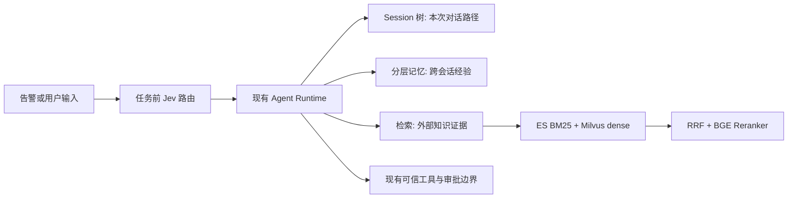

# 树形 Session、Codex 风格记忆、混合检索与 Jev 路由学习手册

> 这是四层概念学习文档。Session 树的已实现代码与证据见 [33 树形 Session](33-树形Session与分支恢复学习手册.md)；其余模块的真实进度以 [PROGRESS](PROGRESS.md) 为准。

## 一张图记住四层

Session 树回答「这次任务走过哪条对话路径」。记忆回答「过去哪些结论值得跨会话使用」。RAG 回答「外部文档里有哪些可引用证据」。Jev 回答「本次任务适合先用哪个模型」。四者的数据来源、生命周期、测评指标不同。

## 1. Session 树：为什么是 `parentId`，而不是复制聊天记录

Pi 的 SessionManager 把消息存成带 `id` 与 `parentId` 的追加记录。当前叶子到根的祖先链构成模型看到的对话；旧分支还在文件中。这样从一个历史 Turn 分支时，无须复制整份文件。`/tree` 是在一份 Session 内导航，`/fork` 则创建新文件；本项目 MVP 先实现同文件分支。

现有 sandboxd 的 Session 是线性 JSONL，resume 读取最后的完整 transcript。扩展时要特别注意工具调用与结果成对、历史副作用不能重放、恢复必须新建 task 和 sandbox。面试中把它叫「语义恢复」，不能叫进程快照。

自测：给 `A -> B -> C` 从 B 建 `D`，两条路径应分别是 `A,B,C` 和 `A,B,D`；恢复 D 后再次查询外部状态，不能把 C 的 ToolMessage 带进去。

## 2. Codex 风格记忆：提取、整理、按需读取

参考 Codex 开源 `codex-rs/memories` 的两阶段写入：单会话材料先提炼为较小的原始记忆与会话摘要，然后跨会话整理为可检索的 `MEMORY.md` 和更短的 `memory_summary.md`。读取时先给摘要，确有需要再取长文。这是渐进披露，目的是减少上下文占用，并保留来源。

本项目 MVP 不需要复制 Codex 的后台任务租约、状态数据库和子 Agent。先用显式命令、文件产物、可重复的输入夹具证明：稳定事实能被记住，过期事实能被更新，恶意日志不能写成新的 System 规则。

自测：同一项目两次会话给出相反版本号，整理后必须标注时间/冲突；从 Session 分支产生的实验结论不能无条件覆盖主支事实。

## 3. 检索：各组件只做一件事

| 组件 | 在主链路中的职责 | 最直接的对照 |
|---|---|---|
| Elasticsearch | 倒排索引、BM25 关键词召回、过滤 | ES BM25 only |
| Milvus | 稠密 embedding 的语义召回 | Milvus dense only |
| RRF | 合并两路不同分数尺度的排名 | BM25 / dense / RRF |
| BGE Reranker | 对少量候选做 query-document 精排 | RRF 与 RRF+rerank |

Milvus 也支持 BM25。若 ES 已负责主链路 BM25，再加 Milvus BM25 需要解释独立价值；最清楚的做法是把它列为消融实验，比较「Milvus 一体化」与「ES + Milvus」的质量、延迟和运维复杂度。索引两边必须使用同一 `chunkId`，否则无法公平测评或追溯来源。

召回质量用带人工相关标签的 query 集计算 Recall@K、MRR、nDCG；答案质量可补充 Ragas 的忠实度/相关性，但不可用它代替来源标签和安全断言。公开 BEIR 数据只证明通用检索能力；运维 Agent 的价值还需自己的合成 runbook 问题集。

自测：若精确资源名只在 ES top10，语义近义句只在 Milvus top10，RRF 应让二者进入候选；rerank 后报告 nDCG 变化，而不是只展示一个漂亮答案。

## 4. Jev：模型选择与授权分开

TypeSafe Jev 可给任务分类或置信度；应用根据标签选择已配置的便宜/强模型。它不能替代 Python Policy 或 Go sandboxd，也不能因为分类为「安全」就开放工具权限。

路由测评要看三条曲线：质量、延迟、费用。必须用同一批任务比较「固定便宜」「固定强」「路由」，并把 Jev 自身请求计入费用和延迟。Replay 可以验证接线、回退和日志；只有经授权的真实双模型对照才能支撑省钱结论。

自测：Jev 超时、返回未知标签、低置信度时，能否稳定选择默认模型且不改变工具权限。

## 5. 为什么本阶段不加 LangGraph

当前项目已有手写双层 Loop、SessionJournal、ModelGateway 和 Replay；树形历史、记忆文件和检索管道都能作为边界清楚的独立模块接入。LangGraph 提供图编排、checkpoint 和复杂中断恢复，但会引入第二套状态/恢复语义；本阶段首先需要证明自己的 `parentId` 路径和测评，而非图框架用法。现有 `langchain-core` 与 `langchain-openai` 可继续只承担模型适配。

## 6. 一分钟面试讲法（实施后按实测数字填写）

“我在现有安全运维 Agent 上做了四个独立可测的模块：会话用追加 JSONL 的 `parentId` 树记录分支，恢复时重建选中路径并创建新任务；跨会话记忆分提取、整理和有界读取三层；知识检索用 ES BM25 与 Milvus dense 双路召回，经 RRF 与 BGE 重排，并在固定标签集上做消融；模型路由在任务开始前由 Jev 选择模型，失败时回退，按质量、延迟、总费用对照固定模型。所有检索和记忆内容只作为不可信证据，实际执行权限仍由原有策略、沙箱、RBAC 与审批门控制。”

在代码和测评完成之前，不能把这段话当作已完成项目经历。
