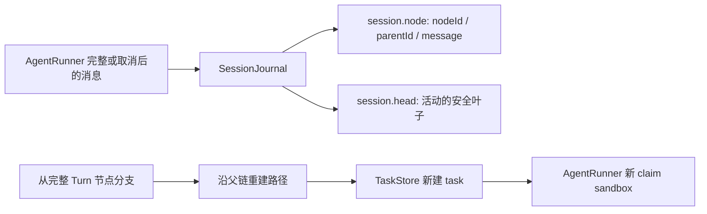

# 树形 Session 与分支恢复：代码、测评和面试讲法

> Phase 7 M1。参考 [Pi Session 格式](https://pi.dev/docs/latest/session-format) 和 [SessionManager 源码](https://github.com/earendil-works/pi/blob/main/packages/coding-agent/src/core/session-manager.ts) 的 `id/parentId` 追加树；本项目继续使用自己的 Python Runtime、安全边界和 JSONL 格式。

## 1. 数据流



`sessionId` 是同一事故的树，`nodeId` 是一条消息，`taskId` 是一次运行，`sandboxId` 是本次执行资源。`session.head` 只指向完整 Turn 的末尾。一次运行沿选中的父节点增加新消息，旧分支不删除。

## 2. 最小实现在哪里

| 文件 | 看什么 |
|---|---|
| `agentd/app/runtime/session.py` | 脱敏消息、JSONL 节点、父链重建、安全分支点、旧格式迁移、截断尾行修复 |
| `agentd/app/store.py` | `resume(session_id, node_id)` 生成新 task 并沿用 sessionId，选中分支的上下文只交给新运行 |
| `agentd/app/main.py` | API Token 保护列树、读路径和分支恢复 |
| `agentd/session_cli.py` | 在不启动 Agent 的情况下查看合成或已有的脱敏 Session |
| `agentd/tests/test_session.py` | 分支、重启、工具组、旧格式、尾行和身份的确定性测试 |

JSONL 增加两种事件：

```json
{"type":"session.node","nodeId":"node-...","parentId":"node-...","taskId":"task-...","message":{"role":"assistant","content":"..."},"branchable":true}
{"type":"session.head","nodeId":"node-...","taskId":"task-..."}
```

原 `session.transcript` 快照继续追加，供旧审计工具读取；新恢复一律按父链。对只有线性快照的旧文件，首次读取树时把最后一份快照中截至完整 Turn 的消息迁移成节点。每条消息仍经过原有脱敏序列化，不保存 Provider 私有字段或隐藏思维。

## 3. 为什么只能从完整 Turn 分支

一个 AI Tool Call 后面可能有多个 ToolMessage。直到所有 `toolCallId` 匹配，才认为这一 Turn 完整；无工具调用的 AIMessage 也是完整 Turn 的结束。若选择半个工具组，恢复时 Provider 消息协议可能无效，还可能误导模型重复执行历史副作用。

恢复只重建模型可见的脱敏消息，并追加普通 HumanMessage。历史 ToolMessage 可供参考，旧工具动作不会再次调用；新 task 会重新申请 sandbox。实时指标、Pod 状态等旧 Observation 可能过时，恢复后的 Agent 应重新查询。

## 4. 运行与验证

在仓库根目录查看公开合成夹具：

```bash
uv run --project agentd --frozen -- python -m agentd.session_cli \
  --session-dir agentd/testdata/session-tree-demo \
  tree session-0123456789abcdef

uv run --project agentd --frozen -- python -m agentd.session_cli \
  --session-dir agentd/testdata/session-tree-demo \
  path session-0123456789abcdef node-0000000000000005
```

真实 Agent API 使用已有 API Token：

```text
GET  /api/v1/sessions/{sessionId}/tree
GET  /api/v1/sessions/{sessionId}/path/{nodeId}
POST /api/v1/sessions/{sessionId}/branch/{nodeId}
POST /api/v1/sessions/{sessionId}/resume
```

`branch` 显式选择完整 Turn；`resume` 使用当前活动叶子。二者返回新 taskId，不恢复旧进程。运行时将 `AGENTD_TRACE_DIR` 指向 WSL 原生目录（例如 `/home/hx/.local/share/sandboxd/agent-traces`），不要把 `/mnt/c` 的 chmod 当成可靠权限边界。

最小测评：

```bash
uv run --project agentd --frozen -- python -m unittest \
  agentd.tests.test_session agentd.tests.test_api -v
```

测试覆盖 `A→B→C` 从 B 另建 D 后两条路径独立、重新实例化后恢复 D、工具调用未完成时拒绝分支、ToolMessage 全部返回后可分支、旧线性快照迁移、末行截断后继续追加、Session 脱敏与文件权限，以及 API Token 限制。它们是本地确定性证据，不等同真实模型或 gVisor 联合 E2E。

## 5. 取舍与限制

- 单进程、单 Worker、同进程 SessionJournal 共用锁；没有多进程文件锁、事务数据库或冲突合并。
- JSONL 节点和兼容快照会重复占盘；小规模演示便于人读，长期运行应做压缩/归档。
- 旧格式自动迁移只处理最后一份完整快照；坏的完整 JSONL 行会明确报错，只有最后一条未写完的行被忽略并在下次追加前截掉。
- API Token 是整个演示系统的共享身份，不提供用户级 Session 所有权。
- 只有模型消息恢复；旧 sandbox、外部请求和 task Workspace 不恢复。

## 6. 面试一分钟讲法

“原项目的 Session 只保存线性 transcript。我参考 Pi 的追加式 `id/parentId` 树，在同一 JSONL 中记录消息节点和活动叶子。分支沿父链重建模型上下文，旧支线保留；只允许完整 Turn 做分支点，避免半个 Tool Call 和历史副作用被重新执行。恢复创建新 task，Runner 重新申请 sandbox；旧线性文件自动迁移。用固定夹具验证了分支隔离、重启恢复、截断尾行、脱敏和 API 权限。这仍是单进程 Demo，不是数据库式会话服务。”
