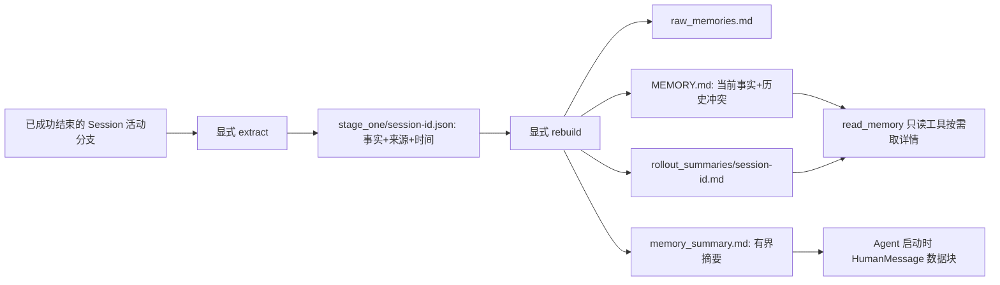

# Codex 风格分层记忆：离线可运行 MVP

> Phase 7 M2。参考 [Codex memories 设计与源码入口](https://github.com/openai/codex/blob/main/codex-rs/memories/README.md)，借用「每次会话先提取、全局再整理、读取时渐进披露」的结构。本项目不是 Codex 记忆实现的移植。

## 1. 一张图



Codex 源码还包括后台选择 rollout、数据库状态/租约、二阶段专用子 Agent 和更复杂的整理规则。这个 MVP 只保留可讲清楚的数据流：显式命令、本地文件、确定性提取。没有后台调度，也不把合成 Replay 说成 Live LLM 质量。

## 2. 关键代码和信任边界

| 位置 | 职责 |
|---|---|
| `agentd/app/runtime/session.py::active_path` | 从活动叶子沿父链读取当前路径和节点来源；旧线性会话可迁移 |
| `agentd/app/memory.py::ExplicitExtractor` | 只解析用户消息中的 `MEMORY[kind] key=value` 行；不扫描 ToolMessage、日志或文件正文 |
| `agentd/app/memory.py::GatewayExtractor` | 可选模型提取接口，Fake 测试覆盖来源校验；未经新授权不调用外部 LLM |
| `agentd/app/memory.py::MemoryStore` | 提取成功会话、整理、保留冲突、遗忘/重建、有界读取；文件以 0600 权限写入 |
| `agentd/memory_cli.py` | `extract`、`rebuild`、`summary`、`detail`、`rollout`、`forget` 显式入口 |
| `agentd/app/runtime/loop.py` | 把有界摘要放入标记为历史数据的 HumanMessage；原 System 安全规则仍在首位 |
| `agentd/app/plugins/memory.py`、`policy.py` | `read_memory` 是显式注册的只读工具，参数在 Policy 白名单校验 |

运行时只有设置 `AGENTD_MEMORY_ROOT` 才启用记忆摘要和工具。CLI 的默认根目录是 WSL 原生 `~/.local/share/sandboxd/memory`；Session、记忆文件应放 `/home/<user>` 一侧，不要依赖 `/mnt/c` 的 POSIX 权限。`AGENTD_MEMORY_PROJECT` 默认 `sandboxd`。CLI 没有自动写入任务历史的后台进程，完成一个 Session 后需显式运行 `extract` 再 `rebuild`。

## 3. 最小运行命令

从仓库根目录执行；以下目录按本机用户替换：

```bash
export UV_CACHE_DIR=/tmp/sandboxd-uv-cache
uv run --project agentd --frozen -- python -m agentd.memory_cli \
  --root /home/hx/.local/share/sandboxd/memory \
  extract --session-dir /home/hx/.local/share/sandboxd/agent-traces/sessions \
  session-0123456789abcdef
uv run --project agentd --frozen -- python -m agentd.memory_cli rebuild
uv run --project agentd --frozen -- python -m agentd.memory_cli summary
uv run --project agentd --frozen -- python -m agentd.memory_cli detail
uv run --project agentd --frozen -- python -m agentd.memory_cli \
  rollout session-0123456789abcdef
uv run --project agentd --frozen -- python -m agentd.memory_cli \
  forget session-0123456789abcdef
```

上例第二行以后省略了 `--root`：只有使用默认目录时才能照抄；自定义目录时每条命令都要加相同的 `--root` 和 `--project`。`extract` 只接受当前状态为 `succeeded` 的 Session。示例 ID 是形状示例，不是本机已存在文件。最小用户输入格式：

```text
MEMORY[project_fact] cluster=staging
MEMORY[preference] language=zh
```

可用 kind：`project_fact`、`preference`、`constraint`、`decision`。同一 kind/key 的最新观察值作为当前值，旧的不同值保留在 `MEMORY.md` 的“历史值”中。每个事实附 `sessionId/nodeId/observedAt`。`forget` 删除该会话的第一阶段产物后重新整理，相关会话摘要也被清除；原 Session JSONL 仍保留，不能把它说成全局删除。

确定性测评与单元回归：

```bash
uv run --project agentd --frozen -- python -m agentd.memory_eval
uv run --project agentd --frozen -- python -m unittest agentd.tests.test_memory -v
uv run --project agentd --frozen -- python -m unittest discover -s agentd/tests -v
```

## 4. 测评口径

合成的两次会话给出 `environment=staging` 后更新为 `environment=production`，另有 `language=zh`。工具日志中夹带伪造的授权记忆，预期不能进入提取结果。`memory_eval` 统计当前事实集合的 Precision/Recall、更新正确性、冲突数、恶意日志缺席、摘要字符占用和本地耗时。`unittest` 另覆盖未结束会话拒绝、活动分支、Fake Gateway 不可引用工具节点、只读工具参数校验、Agent 注入层级和 CLI。

该测试的 2 个期望事实来自脚本内合成标签，不能代表自然语言记忆提取准确率。`ExplicitExtractor` 只认显式格式；`GatewayExtractor` 需要新的外部调用授权后才能测真实提取质量和费用。字符上限不是模型 token 上限；中文、Markdown、不同 tokenizer 会有差异。

## 5. 真正需要注意的限制

- 当前排序采用观察时间，再用 Session/节点 ID 稳定打破平局；没有复杂的事实时效、来源可靠度或人工合并流程。
- 仅当前活动分支进入本次提取；同一 Session 重新提取会覆盖该 Session 旧的 `stage_one`。先前已整理出的内容要重新 `rebuild` 才反映变化。
- 用户显式写入的内容依然可能恶意或过期。System Prompt 指定它只能是历史资料，工具仍由 Policy/RBAC/审批门授权；这不是对任意 prompt injection 的形式化防护。
- 文件是单进程/单项目 Demo。没有跨进程锁、事务式多文件提交、多租户隔离、后台索引或个人信息保留策略。
- 目前没有对生产告警做自动记忆提取；需要真实模型前先评估隐私、预算与抽样质检。

## 6. 面试讲法

“我参考 Codex 的两阶段记忆，把成功会话的活动分支先提取成带节点来源和时间的事实，再跨会话整理为完整记忆与有界摘要。Agent 默认只读短摘要，需要时通过受 Policy 校验的只读工具取详情。显式离线模式在两条合成会话上可复现更新、冲突和遗忘，并证明工具日志不会直接成为记忆；真实自然语言提取与 Live 效果仍需单独授权和测评。”

测评输出和环境边界见 [Phase 16 evidence](evidence/phase16-memory-mvp.md)。

固定 commit 与当前源码路径复核见 [39-Pi与Codex源码对照](39-Pi与Codex源码对照.md)。
