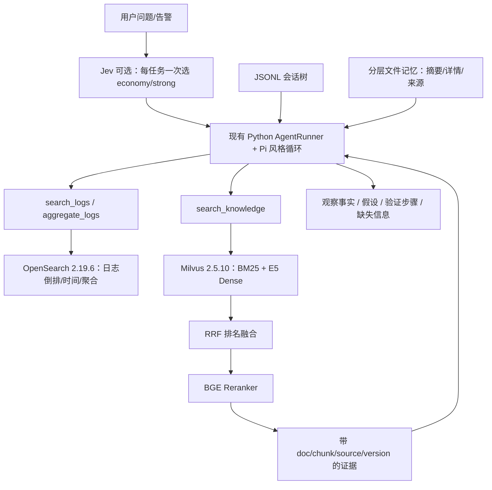

# Kubernetes 运维 Agent MVP：运行、测评与讲解

> Phase 8，持续更新。完整验收规格见 [37](37-Kubernetes运维Agent目标与验收.md)，当前结果与缺口见 [PROGRESS](PROGRESS.md)。真实推理与模型裁判需要明确费用授权；本文不会把 Replay 结果说成 Live 效果。

## 1. 当前架构



- **持久化事实**：Session JSONL 和 Memory 文件。向量索引不是唯一真相，也不负责会话分支。
- **知识**：同一个 Milvus collection 的 BM25 稀疏向量与 Dense；新内容/模型组合创建独立 collection。默认知识检索不访问 ES。
- **日志**：OpenSearch 独立快照索引。模型只填受限参数，Python 编译 DSL；不能选择 endpoint/index 或传任意查询。
- **路由**：只改变固定模型选择，不改变 Policy、插件或 Go 执行授权。无 Key 时关闭；演示有 Fake 路径。
- **编排**：沿用既有手写循环，未为本轮接入 LangGraph。现有 LangChain Core/OpenAI 仅用于消息与模型适配。

## 2. 为什么选择这个检索栈

Milvus 2.5.10 原生 BM25 用 `FunctionType.BM25` 从文本生成 sparse vectors。英文官方文档使用 `standard` analyzer；告警名/错误码可直接命中。中文问题与英文文档不共享词项时，BM25 本身不能做跨语言翻译。

Dense 使用 [multilingual-e5-small 固定版本](https://huggingface.co/intfloat/multilingual-e5-small/tree/614241f622f53c4eeff9890bdc4f31cfecc418b3)：384 维、CPU 本地推理、`query: ` 和 `passage: ` 前缀。模型卡要求这些前缀并说明最长 512 tokens。权重与 tokenizer 的 SHA256 在语料目录的 `embedding-lock.json`。

两路各召回 20，RRF 用 `1/(60+rank)` 相加，保留 20，再由固定 `BAAI/bge-reranker-base`（缓存版本 `2cfc18c`）跨编码重排。不能直接把 BM25 分数与余弦分数相加。MVP Dense 用 FLAT 精确索引，298 chunks 无需引入 ANN 参数调优。

BGE Reranker 改善排序但增加 CPU 延迟；首轮重排后的路径 P50 约 4.96 秒。不能声称混合检索永远更好：开发集上 RRF 的 Recall@5 低于 BM25，最终重排才改善部分指标。问题语言、标题/正文匹配、章节粒度和标签完整性都会影响结果。

## 3. 从零复现核心链路

以下从仓库根目录执行，先安装原有锁文件中的主运行依赖；不需要 LLM Key。

```bash
uv sync --project agentd --frozen --extra rag --extra jev
# 既有 Milvus/ES Compose 保留旧索引；本轮知识工具只用 Milvus
# 只启动 Milvus 所需依赖；旧 ES 不删除
docker compose -p sandboxd-rag -f deploy/retrieval/compose.yml up -d

docker compose -p sandboxd-logs -f deploy/logs/compose.yml up -d
agentd/.venv/bin/python -m agentd.retrieval.fetch_models
agentd/.venv/bin/python -m agentd.retrieval.cli check
agentd/.venv/bin/python -m agentd.retrieval.cli rebuild
agentd/.venv/bin/python -m agentd.logs.cli ingest
agentd/.venv/bin/python -m agentd.retrieval.cli query 'KubePodNotReady 如何排查？'
agentd/.venv/bin/python -m agentd.ops_demo --output .cache/ops-replay.json
```

`fetch_models` 会下载固定版本 E5 与 BGE Reranker；已有文件复用并记录哈希。模型缓存默认 `~/.local/share/sandboxd/models`；可用检索 CLI 的 `--embedding-dir/--reranker-dir` 覆盖。

服务启用时增加 `AGENTD_RETRIEVAL_CORPUS` 指向 ops-v1/corpus.jsonl、`AGENTD_LOGS_FILE` 指向 logs/data/logs.jsonl。模型路径有默认值。**在线检索不读取 queries.jsonl**。认证、sandboxd 和 Prometheus 仍使用项目已有启动方式；不要把 Demo 的 Fake Sandbox 当成真实 gVisor 验收。

## 4. 更新、删除与过滤

```bash
# 删除是新快照中的逻辑删除；旧数据仍可复现历史报告
agentd/.venv/bin/python -m agentd.retrieval.snapshot \
  --corpus agentd/retrieval/data/ops-v1/corpus.jsonl \
  --output .cache/ops-without-payments --delete fixture-payments-memory
agentd/.venv/bin/python -m agentd.retrieval.cli \
  --corpus .cache/ops-without-payments/corpus.jsonl rebuild
```

`--upsert <chunks.jsonl>` 用于新增/修改；按 docId **完整替换文档的所有 chunks**，避免旧章节残留。输出目录必须不存在。新快照要显式切换服务的 corpus 路径；MVP 不提供在线零停机切换。历史测评标签不会自动复制到修改后的快照。

工具的 `filters` 可填 component/source/source_revision/doc_id。Milvus Client 独立验证字段，并将值按 JSON 字符串转义，不能通过 filter 提交表达式。

## 5. 测评分层和命令

| 层 | 证据 | 能证明什么 |
|---|---|---|
| 会话/记忆 | Python 单测、memory_eval | 分支隔离、恢复、完整工具组、冲突/遗忘/预算等确定性行为 |
| 检索 | 实际 Milvus + E5/BGE，60 候选题 | 固定候选标签下四组召回与排序差异 |
| 日志 | 实际 OpenSearch，720 合成日志/40 用例 | 参数编译后执行结果与独立 Python oracle 一致 |
| 性能 | OpenSearch Benchmark 单独工作负载 | 本机有限数据和并发下的测量；不能外推生产 |
| 联合 Replay | AgentRunner + 实际本地存储 | 工具接线、现场数据、文档引用与 Session 恢复 |
| Live / Ragas | 需独立预算与原始评分 | 模型决策、生成和模型裁判意见；不是人工评价 |

```bash
agentd/.venv/bin/python -m unittest discover -s agentd/tests -v
agentd/.venv/bin/python -m agentd.memory_eval
agentd/.venv/bin/python -m agentd.retrieval.cli eval --output .cache/ops-rag-results.json
agentd/.venv/bin/python -m agentd.logs.cli eval --output .cache/ops-log-results.json
agentd/.venv/bin/python -m agentd.router_live_eval --limit 2  # 仅离线预览
```

日志的区间为 `[start,end)`，时区必须明确，最长 7 天。上下文查询由 trace_id 或相邻时间窗实现。默认返回3条，底层查询上限100条；Agent 工具另外拒绝超过3500字节的结果，要求缩小 limit、窗口或分组，避免 Runtime 的4KiB预算把 JSON 截坏。Precision/Recall 计算的是预期排序截断后的结果页，完整命中 total 和 truncated 标记另行比较。聚合拒绝近似或遗漏 bucket。40 条参数用例不能证明自然语言到参数的能力。

## 6. 首轮运维检索结果

固定 corpus `050f89fc…`，50 可回答/10 无答案，模型编写候选标签、待人工审核。完整逐题排名、引用、耗时和分割结果见 [原始报告](evidence/phase23-ops-rag-results.json)。

| 组 | Recall@5 | Recall@10 | MRR | nDCG@10 | 路径 P50 ms |
|---|---:|---:|---:|---:|---:|
| BM25 | 0.5567 | 0.6367 | 0.3475 | 0.4123 | 319 |
| Dense | 0.4633 | 0.5783 | 0.3960 | 0.4021 | 399 |
| Hybrid/RRF | 0.5633 | 0.7217 | 0.4706 | 0.5087 | 637 |
| Hybrid + Reranker | 0.7083 | 0.8500 | 0.5930 | 0.6372 | 4958 |

BM25/Dense 时间是独立阶段；RRF/rerank 为串行累计时间，包含各自需要的上游步骤，非模型生成端到端时间。首题含冷重排模型加载。Python RSS 峰值约 2233 MiB；四组模型 API 费用均为 0，不等于本机算力没有成本。

失败示例：

- ops11/12 口语中文节点异常：目标章节未进入重排前五，跨语言语义仍不足。
- ops20 卷错误：找到了正确文档的 Meaning/Mitigation，却没找到标注的 Diagnosis；严格 chunk 标签与文档级相关性不同。
- ops24 inode/字节空间：相近资源术语混淆；也存在另一个同样有效的 inode runbook 未被当前候选标签覆盖的问题，需要人工补标。
- 无答案题即使仍返回相似文档也不能当作答案；需要生成阶段明确拒答或请求缺失证据。

后续只在 dev 上尝试术语扩展、段落与标题组合、较大 multilingual model、重排候选数，保留原始报告。不要针对已经看过的 test 题改标签或调参后宣称盲测提升。

## 7. 三类联合演示

[联合回放报告](evidence/phase23-joint-replay.json) 中 payments 内存、checkout Service、catalog readiness 三类均通过实际本地工具执行及确定性断言。每例先查日志、再聚合、再按错误码检索。引用 ID 来自真实返回值，不由脚本预填不存在的 ID。

模型决策为脚本、路由为 Fake、Sandbox 为生命周期替身；没有真实 LLM，也没有操作真实 Kubernetes 或恢复服务。引用 ID 能解析不等于自然语言断言都得到引用支持，后者需要模型裁判/人工审核。

## 8. 面试讲解顺序

1. 先解释场景：收到告警，区分“现场发生了什么”和“通常怎么排查”。
2. 再讲数据流：日志走 OpenSearch，知识走 Milvus 混合检索，Reranker 以额外延迟换排序质量。
3. 说明 Agent 状态：Session 树支持分支恢复；分层记忆做跨会话事实整理，索引只是可重建派生物。
4. 拿出消融与失败例：最小系统的价值是可复现、能解释局限，不是报一个高分。
5. Jev 是任务开始前的一次模型选择；超时/低置信度回退 strong，权限与安全边界完全独立。

Pi 会话实现与 Codex 记忆差异见 [33](33-树形Session与分支恢复学习手册.md)、[34](34-Codex风格分层记忆学习手册.md)。记忆目前只确定性识别显式 MEMORY 标记，不能宣称已经测出自然语言记忆提取准确率。
