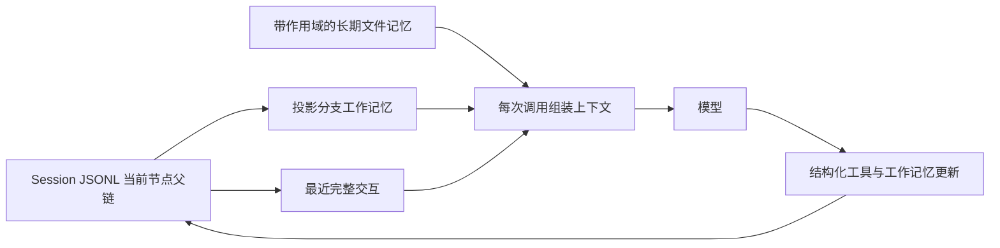

# 运维 Agent 工作记忆与上下文压缩

本页解释 Session 树、任务工作记忆、长期记忆与模型窗口如何配合。实现以 `agentd/app/working_memory.py`、`runtime/session.py`、`context.py` 为准；验证结果必须另附实际命令输出，不能把本页设计文字当作运行证据。

## 一张图



Session JSONL 是可追溯原件。工作记忆由选中父链上的工具结果、已接受的 `update_working_memory` 调用以及最终回答中的 `workingMemoryUpdate` 投影而来。从旧节点分支，只能看见该节点之前的更新。初始告警和每个完整工具轮次都是恢复边界；半轮工具记录不成为活动叶子。恢复直接读取记录，不重新执行旧工具；模型随后提出的新调用仍受 Policy 校验。

## 工作记忆的信任边界

- 工具结果获得稳定 `evidenceId`、`observedAt`；工作记忆仅保留有界摘录和原件指针。
- `update_working_memory` 接受 `hypotheses`（`text/status/evidenceIds`）和 `pendingChecks`。省略字段保留旧值，显式空待办列表才清空。脱敏后的总更新上限 3000 UTF-8 字节，超限明确拒绝。程序验证引用确实来自当前分支；模型提出的 `supported` 仍是**模型判断**。
- 已尝试的检查从实际工具调用投影，并记录成功、失败或拒绝。当前状态默认 60 秒后标成 `stale`；Prometheus 同时检查查询时间和样本时间，未知样本时间不能标成当前。日志单列事件时间及查询窗口。
- K8s UID 可从 sandboxd 的合法 JSON `stdout` 提取，并在单次结果截断时保留。资源身份分为 `matched/unverified/mismatch`；匹配要求明确集群加相同 UID，或明确集群、namespace、workload 三者都一致。当前 sandboxd 响应通常没有集群身份，因此会保守标成 `unverified`。
- 最终输出前重新检查状态时效。同一查询最新证据仍过期或样本时间未知时，公开诊断降级为“当前状态未核实”，不自动追加模型调用。原模型回答仍在 Session；这是一项保守门槛，可能阻止包含有用历史分析的结论，并不验证自然语言因果关系。
- 工作记忆、长期记忆和检索结果以低信任数据进入模型视图；工具权限仍由 Policy、Connector 和 Go 端约束。

## 窗口如何压缩

每次模型调用组装当前系统规则、原始告警、当前分支工作记忆、适用长期记忆和最近完整交互。恢复旧 Session 也使用当前系统规则，原文件保留旧版本。旧的自动注入记忆消息从模型视图去重；被假设引用的旧证据另保留有界来源指针。预算计入工具定义、消息开销与 4096 token 输出预留；默认上限 32768 **估算** token，并保留 48 KiB 字符上限。估算使用 UTF-8 字节，不等于精确 tokenizer 计数。最新交互和最新拒绝无法同时容纳时安全停止。工具调用与结果始终配对，原始 JSONL 不因压缩删除。

## 长期记忆作用域

显式提取和 `rebuild/forget` 保持原流程。新候选事实从 Session 告警标签记录 `cluster/namespace/workload/component/revision`；同类型、同 key、同作用域才合并冲突。自动摘要要求明确 cluster，且事实每个已填写字段都匹配当前任务。旧无作用域条目仍在原文件，只有显式 `read_memory(level=legacy)` 才读取；`detail` 和指定 Session 的 `rollout` 在运行任务中默认按范围读取。缺少 cluster 的任务不会自动加载项目记忆。

## 最小验证

```bash
uv run --project agentd --frozen -- python -m unittest agentd.tests.test_working_memory agentd.tests.test_memory agentd.tests.test_session agentd.tests.test_context -v
uv run --project agentd --frozen -- python -m unittest discover -s agentd/tests -v
agentd/.venv/bin/python -m agentd.memory_context_eval --output docs/evidence/phase8-memory-context-replay.json
agentd/.venv/bin/python -m agentd.ops_demo --output docs/evidence/phase8-joint-replay.json
```

Session 工作记忆只读接口：`GET /api/v1/sessions/{sessionId}/working-memory?nodeId={完整轮次节点ID}`；省略 `nodeId` 读取活动叶子，使用与 Session 查询相同的 Agent Token。重点演示旧节点与新叶子的假设不同、状态过期后仍能查到历史证据、无效 evidence ID 被拒绝。

这套实现没有自动证明模型假设正确，也没有通过本地 Replay 证明真实模型会主动更新工作记忆。真实模型质量、费用和延迟须另做有界测评。

实测数值与原始报告见 [Phase 8 验收记录](evidence/phase8-memory-optimization.md)。
